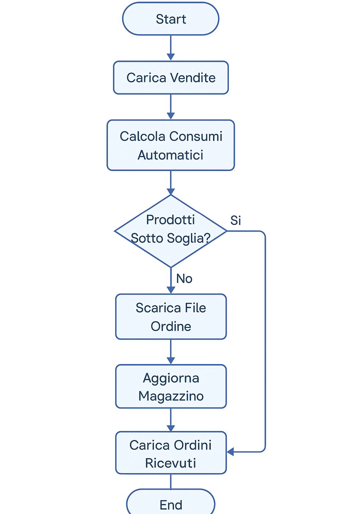

# inventarify2
# 🧠 Sistema Intelligente di Gestione Magazzino

Questo progetto è un'applicazione interattiva basata su **Streamlit** per la gestione automatizzata del magazzino di un ristorante.  
Il sistema combina vendite, ricette e scorte per generare analisi, suggerire riordini e mantenere l'inventario sempre aggiornato.

---

## 🚀 Funzionalità principali

- 📤 Caricamento vendite giornaliere da file CSV
- 🍽️ Associazione piatti → ricette → ingredienti
- 📦 Visualizzazione magazzino con quantità aggiornate
- ⚠️ Avvisi automatici su prodotti sotto scorta
- 📥 Download CSV dei prodotti da riordinare
- 📋 Checklist interattiva per aggiornare l'inventario dopo la ricezione merce
- 📊 Dashboard analitica su vendite e consumi

---

## 🔁 Flusso Operativo

1. **Inizializzazione Database**
   - Carica `menu.csv` (ricette) e `prodotti_magazzino.csv` (scorte)
2. **Vendite**
   - Carica `vendite.csv` → il sistema calcola automaticamente il consumo ingredienti
3. **Controllo Magazzino**
   - Confronta quantità residue e soglia riordino
   - Scarica `prodotti_da_riordinare.csv`
4. **Ordini & Ricezione**
   - Carica `ordini.csv` → usa la checklist per aggiornare lo stock
   - Magazzino aggiornato automaticamente

---

## 🧾 Formato file richiesti

| Nome file                | Campi richiesti                                      |
|--------------------------|------------------------------------------------------|
| `menu.csv`               | `piatto`, `prodotto`, `quantità_prodotto`           |
| `prodotti_magazzino.csv` | `prodotto`, `quantità_attuale`, `unità`, `soglia_riordino` |
| `vendite.csv`            | `data`, `piatto`, `quantità_venduta`                |
| `ordini.csv`             | `prodotto`, `quantità`                               |

---

## 📊 Interfaccia

- **Home**: guida introduttiva e flusso sistema
- **Analytics**: report vendite, consumo ingredienti, prodotti sotto soglia
- **Prodotti Magazzino**: upload inventario, quantità aggiornate, download CSV
- **Menu**: visualizza o aggiorna le ricette
- **Vendite**: storico vendite + reset dati
- **Ordini**: checklist interattiva per aggiornare stock

---

## 🛠️ Tecnologie utilizzate

- [Streamlit](https://streamlit.io/)
- [SQLite + DuckDB](https://duckdb.org/)
- [Pandas](https://pandas.pydata.org/)
- [Altair](https://altair-viz.github.io/)

---

## 📸 Immagini

### Flusso Logico


> Inserisci l'immagine nella cartella `img/` del repository GitHub.

---

## ✅ Esecuzione locale

```bash
pip install -r requirements.txt
streamlit run app.py
